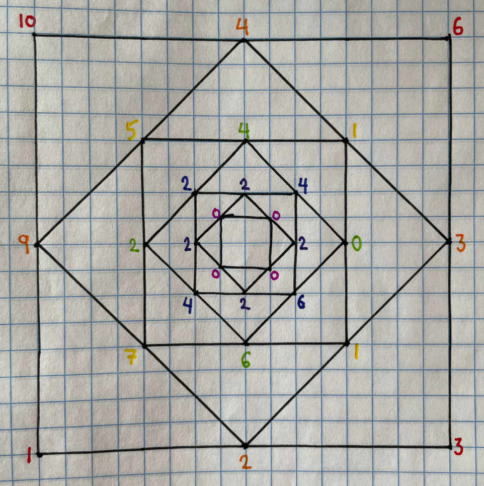

# Lesses more
## JANUARY 2023: PUZZLE

Assign four nonnegative integers to the corners of a square, which we designate the active square. During a step, for each side of the active square, the absolute difference between the numbers on that side’s endpoints is assigned to its midpoint. Then these four new midpoints are connected into a new square (tilted 45 degrees from the previous). This new smaller square becomes the active square. Continue these steps until the active square has all zeroes on its corners.
  
Define f(a, b, c, d) to be the total number of squares drawn during this process when beginning with the numbers (a, b, c, d) written on the starting square in clockwise order. For example, given a starting arrangement of (10, 6, 3, 1), we would get the sequence of
  
(4, 3, 2, 9)  
(1, 1, 7, 5)  
(0, 6, 2, 4)  
(6, 4, 2, 4)  
(2, 2, 2, 2)  
(0, 0, 0, 0)  
 
where the game ends (pictured above). So f(10, 6, 3, 1) = 7. And trivially, f(0, 0, 0, 0) = 1. 
 
Consider the set S = {(a, b, c, d) | a, b, c, and d are all integers with 0 <= a, b, c, d <= 10,000,000}. Let M be the maximum value f obtains on S. Find (a, b, c, d) in S with minimum sum (a+b+c+d) where f(a, b, c, d) = M. Enter your answer as a semicolon-separated list, 10;6;3;1 for example.
